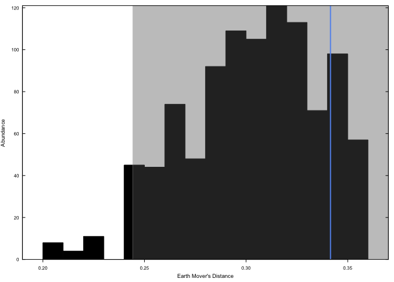
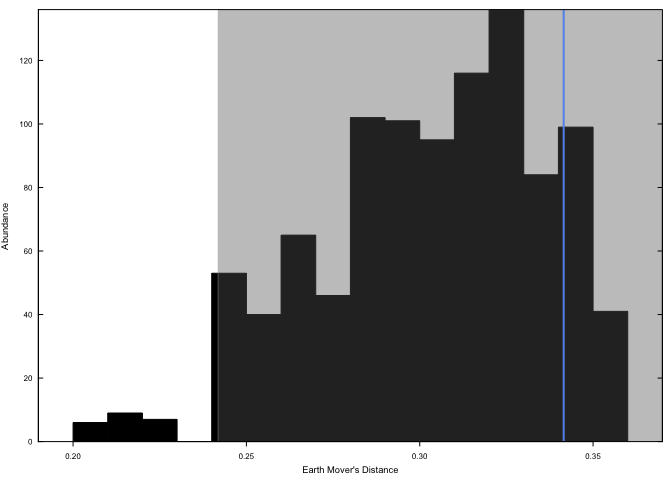

<!-- README.md is generated from README.Rmd. Please edit that file -->

# paleotools

<!-- badges: start -->
<!-- badges: end -->

The goal of paleotools is to …

## Installation

You can install the development version of the package from
[GitHub](https://github.com/) with:

``` r
# install.packages("devtools")
devtools::install_github("mchevalier2/paleotools")
```

## Example

This is a basic example which shows you how to solve a common problem.

``` r
library(PTBoxEMD)
#> 
#> Attaching package: 'PTBoxEMD'
#> The following objects are masked from 'package:paleotools':
#> 
#>     EMD, test.EMD

example(EMD)
#> 
#> EMD> EMD(1:5, 6:10)
#> [1] 0.125
#> 
#> EMD> m <- matrix(1:25, ncol=5)
#> 
#> EMD> for(i in 1:5) m[i,i] <- 0
#> 
#> EMD> EMD(1:5, 6:10, weight.m=m)
#> [1] 0.7916669
#> 
#> EMD> ## Not run: 
#> EMD> ##D   EMD(1:5, 1:6)
#> EMD> ## End(Not run)
#> EMD> 
#> EMD> 
#> EMD> 
#> EMD>
example(test.EMD)
#> 
#> ts.EMD> m1 <- matrix(abs(rnorm(25)), ncol=5)
#> 
#> ts.EMD> m2 <- matrix(abs(rnorm(25)), ncol=5)
#> 
#> ts.EMD> test.EMD(m1, m2)
#> 
#>  Testing significativity of the EMD
#> 
#> Measured EMD:  0.342 
#> Randomised data:   Min       1%     5%      10%
#>                  0.209    0.22    0.244   0.255 
#> pvalue =  0.892
```



    #> 
    #> ts.EMD> res <- test.EMD(m1, m2)
    #> 
    #>  Testing significativity of the EMD
    #> 
    #> Measured EMD:  0.342 
    #> Randomised data:   Min       1%     5%      10%
    #>                  0.209    0.22    0.242   0.255 
    #> pvalue =  0.908



    #> 
    #> ts.EMD> str(res)
    #> List of 3
    #>  $ target    : num 0.342
    #>  $ pvalue    : num 0.908
    #>  $ randomised: num [1:1000] 0.288 0.31 0.255 0.279 0.291 ...
    #> 
    #> ts.EMD> ## Not run: 
    #> ts.EMD> ##D   test.EMD(m1, m2, save=TRUE, filename='test-emd.png')
    #> ts.EMD> ## End(Not run)
    #> ts.EMD> 
    #> ts.EMD> 
    #> ts.EMD> 
    #> ts.EMD>
