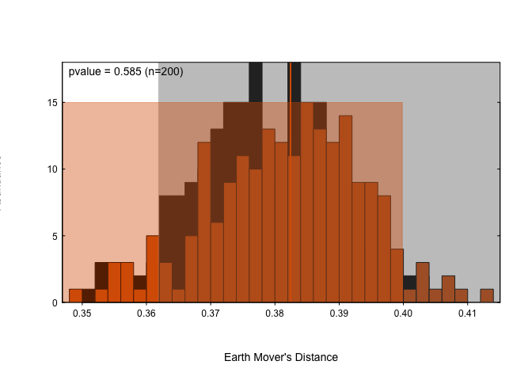

<!-- README.md is generated from README.Rmd. Please edit that file -->

# paleotools

<!-- badges: start -->
<!-- badges: end -->

The goal of paleotools is to …

## Installation

You can install the development version of the package from
[GitHub](https://github.com/) with:

``` r
# install.packages("devtools")
devtools::install_github("mchevalier2/paleotools")
```

## Example

This is a basic example which shows you how to use the Earth Movers’
Distance (EMD) and the associated significance test.

``` r
library(paleotools)

EMD(1:5/sum(1:5), 6:10/sum(6:10))
#> [1] 0.125
EMD(1:5, 6:10) # The vectors are normalised by the function
#> [1] 0.125
m <- matrix(1:25, ncol=5)
for(i in 1:5) m[i,i] <- 0
EMD(1:5, 6:10, weight.m=m)
#> [1] 0.03298612
```

``` r
m1 <- matrix(abs(rnorm(500)), ncol=5) ; m1 <- m1 / apply(m1, 1, sum)
m2 <- matrix(abs(rnorm(500)), ncol=5) ; m2 <- m2 / apply(m2, 1, sum)
EMD.test(m1, m2, plot=FALSE)
#> 
#>  Testing significativity of the EMD
#> 
#> Measured EMD: 0.382 
#> Uncertainty range:   Max    99%     95%     90%
#>                    0.415      0.41    0.402   0.4 
#> Randomised data:     Min     1%      5%     10%
#>                    0.345      0.355   0.36    0.362 
#> pvalue = 0.61
res <- EMD.test(m1, m2, plot=TRUE, verbose=TRUE)
#> 
#>  Testing significativity of the EMD
#> 
#> Measured EMD: 0.382 
#> Uncertainty range:   Max    99%     95%     90%
#>                    0.413      0.406   0.4     0.396 
#> Randomised data:     Min     1%      5%     10%
#>                    0.35   0.353   0.362   0.364 
#> pvalue = 0.585
res <- EMD.test(m1, 1+m1, plot=TRUE, verbose=TRUE, nrep=100)
#> 
#>  Testing significativity of the EMD
#> 
#> Measured EMD: 0.225 
#> Uncertainty range:   Max    99%     95%     90%
#>                    0.242      0.24    0.239   0.234 
#> Randomised data:     Min     1%      5%     10%
#>                    0.267      0.268   0.269   0.269 
#> pvalue < 0.01
str(res)
#> List of 4
#>  $ target      : num 0.225
#>  $ pvalue      : num 0
#>  $ randomised  : num [1:100] 0.273 0.273 0.277 0.27 0.271 ...
#>  $ bootstrapped: num [1:100] 0.235 0.223 0.223 0.231 0.239 ...
```


